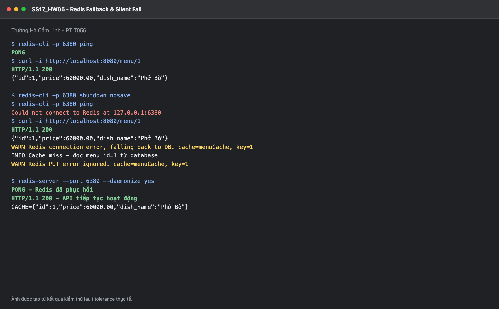

# SS17_HW05 - Xử lý ngoại lệ và fallback khi Redis lỗi

**Sinh viên:** Trương Hà Cẩm Linh - **Mã sinh viên:** PTIT056

## 1. Mục tiêu

Ứng dụng GrabFood dùng Redis để tăng tốc API menu nhưng database vẫn là nguồn dữ liệu chính. Khi Redis mất kết nối, lỗi cache phải được ghi log và bỏ qua để API tiếp tục đọc hoặc cập nhật database, không trả HTTP 500.

## 2. Luồng hoạt động

Khi Redis bình thường:

1. `GET /menu/{id}` kiểm tra `menuCache::id`.
2. Cache hit trả dữ liệu ngay; cache miss đọc DB rồi ghi Redis.
3. `PUT` và `DELETE` cập nhật DB trước, sau đó evict cache.

Khi Redis bị sập:

1. Spring gọi Redis và nhận `RuntimeException`.
2. `CustomCacheErrorHandler` ghi log nhưng không ném exception tiếp.
3. Với GET, Spring tiếp tục chạy method `getMenuById`, vì vậy dữ liệu được lấy từ DB.
4. Với PUT/DELETE, lỗi evict được bỏ qua sau khi DB đã cập nhật thành công.
5. Khi Redis hoạt động lại, GET kế tiếp có thể ghi cache trở lại.

Lưu ý kỹ thuật: `handleCacheGetError` có kiểu trả về `void`, không thể viết `return null`. Việc handler không rethrow exception tạo hiệu ứng silent fail/cache miss để Spring gọi logic DB.

## 3. Đăng ký ErrorHandler

`CacheConfig` triển khai `CachingConfigurer`:

```java
@Bean
@Override
public CacheErrorHandler errorHandler() {
    return new CustomCacheErrorHandler();
}
```

Trong cùng cấu hình, bean `RedisCacheManager` dùng serializer JSON và TTL 10 phút. Spring Cache dùng `CacheManager` để thao tác Redis và dùng `errorHandler()` để xử lý lỗi GET, PUT, EVICT, CLEAR.

## 4. API

```text
GET    /menu/{id}
PUT    /menu
DELETE /menu/{id}
```

## 5. Chạy và kiểm thử

```bash
docker compose up -d
./gradlew clean test
./gradlew bootRun
```

Redis có tên `redis-lab` và ánh xạ cổng `6380`.

```bash
curl -i http://localhost:8080/menu/1
redis-cli -p 6380 GET 'menuCache::1'

docker stop redis-lab
curl -i http://localhost:8080/menu/1

# API vẫn HTTP 200; console có:
# Redis connection error, falling back to DB
# Cache miss - đọc menu id=1 từ database

docker start redis-lab
curl -i http://localhost:8080/menu/1
```

## 6. PUT và DELETE khi Redis lỗi

```bash
curl -i -X PUT http://localhost:8080/menu \
  -H 'Content-Type: application/json' \
  -d '{"id":1,"dish_name":"Phở Bò Đặc Biệt","price":75000}'

curl -i -X DELETE http://localhost:8080/menu/1
```

Hai thao tác database vẫn hoàn thành. Handler chỉ log `Redis EVICT error ignored` thay vì làm request thất bại. Trong hệ thống thật cần metric/cảnh báo vì silent fail không có nghĩa là che giấu sự cố vận hành.

## 7. Minh chứng



Ảnh thể hiện Redis từ `PONG` chuyển thành mất kết nối, API vẫn trả HTTP 200 và dữ liệu đúng từ database, sau đó Redis được bật lại và cache hoạt động trở lại.
